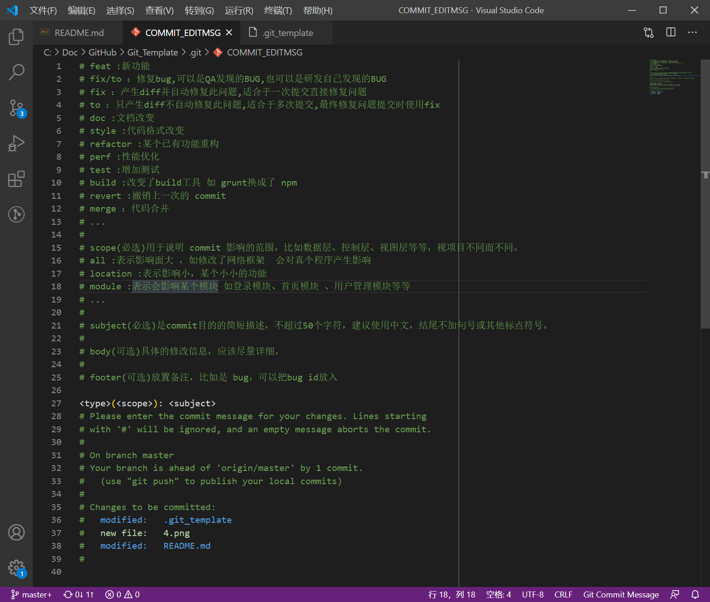

# Git commit 提交规范

## commit message template
[Angular规范](https://github.com/angular/angular.js/blob/master/DEVELOPERS.md#-git-commit-guidelines)是目前使用最广泛的写法：
Each commit message consists of a header, a body and a footer. The header has a special format that includes a type, a scope and a subject:

```
<type>(<scope>): <subject>
<BLANK LINE>
<body>
<BLANK LINE>
<footer> 
```

其中 type 的值(必选)可以有
* feat :新功能 
* fix/to ：修复bug,可以是QA发现的BUG,也可以是研发自己发现的BUG
* fix ：产生diff并自动修复此问题,适合于一次提交直接修复问题
* to ：只产生diff不自动修复此问题,适合于多次提交,最终修复问题提交时使用fix
* doc :文档改变
* style :代码格式改变
* refactor :某个已有功能重构
* perf :性能优化
* test :增加测试
* build :改变了build工具 如 grunt换成了 npm
* revert :撤销上一次的 commit 
* merge ：代码合并
* ...

scope(必选)用于说明 commit 影响的范围，比如数据层、控制层、视图层等等，视项目不同而不同。
* all :表示影响面大 ，如修改了网络框架  会对真个程序产生影响
* loation :表示影响小，某个小小的功能
* module :表示会影响某个模块 如登录模块、首页模块 、用户管理模块等等
* ...

subject(必选)是commit目的的简短描述，不超过50个字符，建议使用中文，结尾不加句号或其他标点符号。

body(可选)具体的修改信息，应该尽量详细。

footer(可选)放置备注，比如是 bug，可以把bug id放入

通常简化的提交信息只需要第一行即可，故新建如下的 git commit template:
```
<type>(<scope>): <subject>


# * feat :新功能 
# * fix/to ：修复bug,可以是QA发现的BUG,也可以是研发自己发现的BUG
# * fix ：产生diff并自动修复此问题,适合于一次提交直接修复问题
# * to ：只产生diff不自动修复此问题,适合于多次提交,最终修复问题提交时使用fix
# * doc :文档改变
# * style :代码格式改变
# * refactor :某个已有功能重构
# * perf :性能优化
# * test :增加测试
# * build :改变了build工具 如 grunt换成了 npm
# * revert :撤销上一次的 commit 
# * merge ：代码合并
# * ...
# 
# scope(必选)用于说明 commit 影响的范围，比如数据层、控制层、视图层等等，视项目不同而不同。
# * all :表示影响面大 ，如修改了网络框架  会对真个程序产生影响
# * loation :表示影响小，某个小小的功能
# * module :表示会影响某个模块 如登录模块、首页模块 、用户管理模块等等
# * ...
# 
# subject(必选)是commit目的的简短描述，不超过50个字符，建议使用中文，结尾不加句号或其他标点符号。
# 
# body(可选)具体的修改信息，应该尽量详细。
# 
# footer(可选)放置备注，比如是 bug，可以把bug id放入
```
根据以上规范git commit message将是如下的格式：
```
       fix(DAO):用户查询缺少username属性 
       feat(Controller):用户查询接口开发
```
保存为`.git_template`(自定义)，可放到根目录下，我放在`/Users/JunQiLiu/.git_template`,打开 git bash,输入命令

```
git config --global commit.template /Users/JunQiLiu/.git_template
```

即可完成模板设置。

提交时，输入命令
```
git commit
```
将自动打开模板文档，可以在此输入你的提交信息：


关闭后将完成提交:


